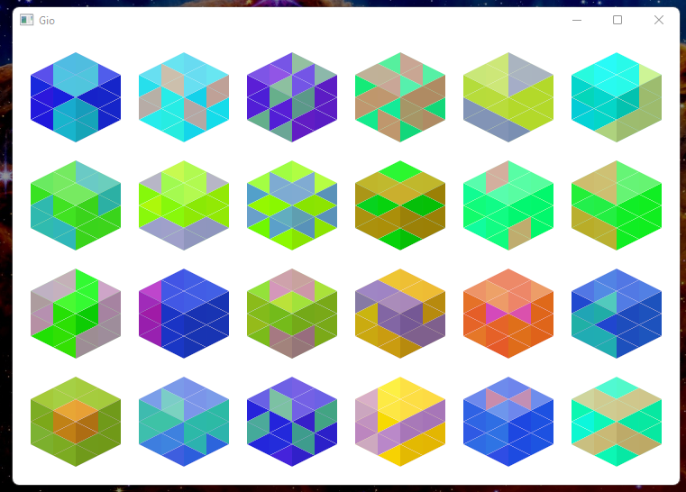

# Gio UI Hashicon

This is a GO port of a pretty javascript canvas hashicon <https://github.com/emeraldpay/hashicon>.  
**Full credit to the original creator and contributors.**



## Usage

`go get gioui-hashicon`

```go

import "github.com/g45t345rt/gioui-hashicon"

hash := "9dddff8f-be81-4c27-80c8-099327865f3f"
size := 100

// use this inside the GIO render loop
Hashicon{Config: DefaultConfig}.Layout(gtx, size, hash)
```

Check the example folder for a detailed usage.
